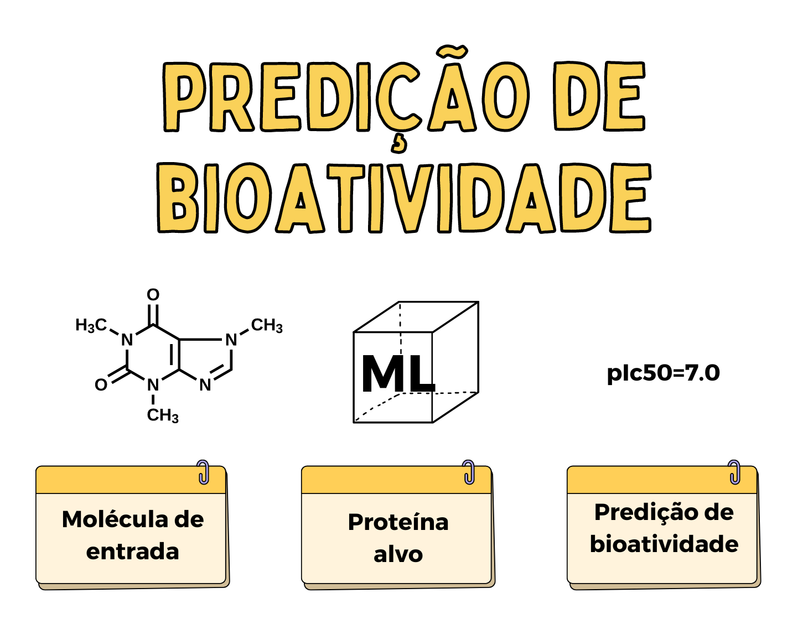

# 

## Aplicativo de Previsão de Bioatividade

Este repositório contém um aplicativo web para previsão de bioatividade de compostos utilizando técnicas de machine learning.

## Reproduzindo este aplicativo web
Para recriar este aplicativo web no seu próprio computador, siga os passos abaixo.

### 1. Criar o ambiente Conda
Primeiramente, crie um ambiente Conda chamado **bioactivity**:

```bash
conda create -n bioactivity python=3.7.9
```

Em seguida, ative o ambiente **bioactivity**:

```bash
conda activate bioactivity
```

### 2. Instalar as bibliotecas necessárias

Baixe o arquivo `requirements.txt` com as dependências necessárias:

```bash
wget https://raw.githubusercontent.com/daniirocca/bioactivity-prediction-app/main/requirements.txt
```

Instale as bibliotecas:

```bash
pip install -r requirements.txt
```

### 3. Gerar o arquivo PKL

O modelo de machine learning utilizado neste aplicativo precisa ser gerado executando o notebook Jupyter [bioactivity_prediction_app.ipynb](https://github.com/daniirocca/bioactivity-prediction-app/blob/main/bioactivity_prediction_app.ipynb). Ao finalizar a execução de todas as células de código, um arquivo chamado `acetylcholinesterase_model.pkl` será gerado.

### 4. Executar o aplicativo

Por fim, para iniciar o aplicativo, execute o comando abaixo:

```bash
streamlit run app.py
```
